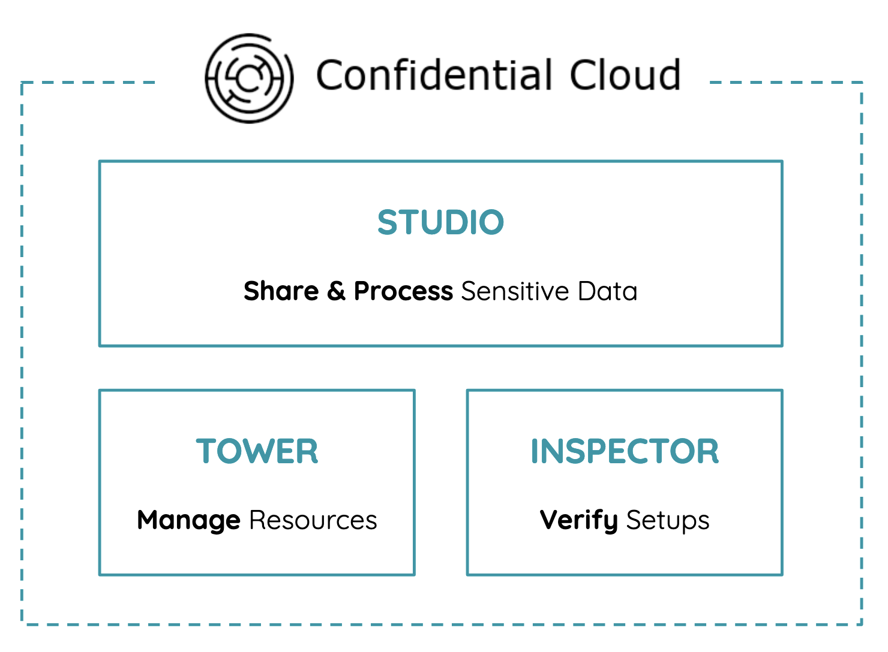

# Architecture

Confidential Cloud is designed in 3 main **microservices**: [Studio](#studio), [Tower](#tower) and [Inspector](#inspector).

## Studio

Studio allows organisations to **share & process** sensitive data.
It offers a simple UX interface facilitates the collaboration with external partners, logs all ongoing activities, and provides detailed reports for a fully, trustworthy collaboration.

## Tower

Tower **manages** the execution environment.
It creates all the required infrastructure resources and a Trusted Execution Environment (TEE, see [Confidential Computing](https://www.canarybit.eu/what-is-confidential-computing-and-why-should-i-care/)) on the Cloud Service Provider of your choice, or On-Prem (see [Infrastructure]()).
It destroys all the resources as soon as the execution is completed or compromised, for a one time and one purpose only execution environment.

## Inspector

Inspector **verifies & certifies** the execution environment.
It makes sure the hardware setup has Confidential Computing capability enabled and collects all required hardware details to attest its security level.
It monitors the infrastructure and guarantees unsafe environments are destroyed if execution policies are not met.
