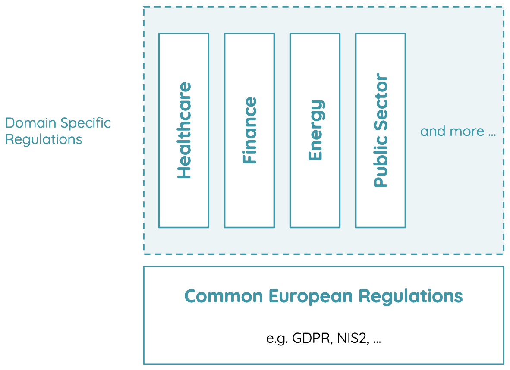

# Compliance

Confidential Cloud helps address legal risks for the customer entity’s information asset: **confidentiality**, **integrity**, and **availability**.

Common risks include the risk of the Cloud Service Provider being obliged to provide access to third country Government Agencies such as law enforcement or intelligence agencies.
Well known examples impacting European-based companies using e.g. MS Azure, AWS, GCP and others, are the United States Federal Law named [CLOUD Act](https://www.alstonprivacy.com/cloud-act-impact-cross-border-access-contents-communications/) and the Foreign Intelligence Surveillance Act - [FISA Section 702](https://www.dni.gov/files/icotr/Section702-Basics-Infographic.pdf).

Data and algorithms processed in Confidential Cloud **cannot be technically accessed** by anyone else than their owners.

CanaryBit is incorporated in Sweden, operates under European regulations, and is controlled by exclusively European ownership.
