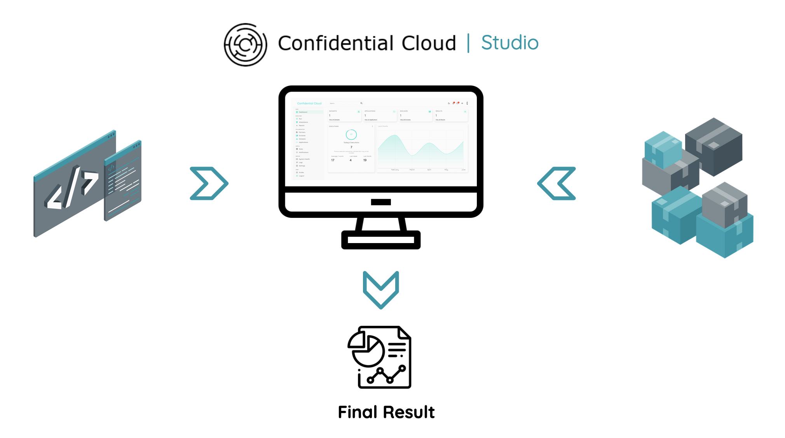

**Hello!**

# Confidential Cloud - Official Documentation

[Confidential Cloud](http://confidentialcloud.io) is CanaryBit's PaaS solution for **Businesses** and **Public Authorities**, willing to collaborate by sharing and processing their **sensitive** digital assets: data or algorithms.

Run workloads on different [infrastructure setups](infrastructure.md) supporting [Confidential Computing](https://www.canarybit.eu/what-is-confidential-computing-and-why-should-i-care/), and get an **auditable certificate** of the encrypted, execution environment.
