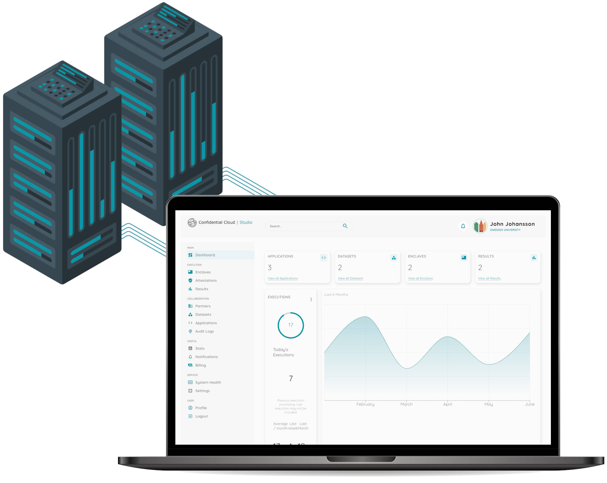

**Welcome!**

# CanaryBit Confidential Cloud

[Confidential Cloud]((https://www.canarybit.eu/confidential-cloud)) is a suite of advanced security solutions developed by [CanaryBit](https://www.canarybit.eu), designed to provide **Enterprises** and the **Public Sector** with robust tools for infrastructure and AI security.

The **cross-industry** tools are particularly valuable for organisations in mission-critical domains and critical infrastructure, such as Finance, Healthcare, Energy, Digital Infrastructure, Defence and more. Organizations using Confidential Cloud can finally **guarantee end-to-end data protection** by immediately detecting faulty execution environments that do not meet custom security requirements, and **maintain compliance** with industry-specific regulatory requirements.

 

{: style="width:80%; display: block; margin: 0 auto;"}