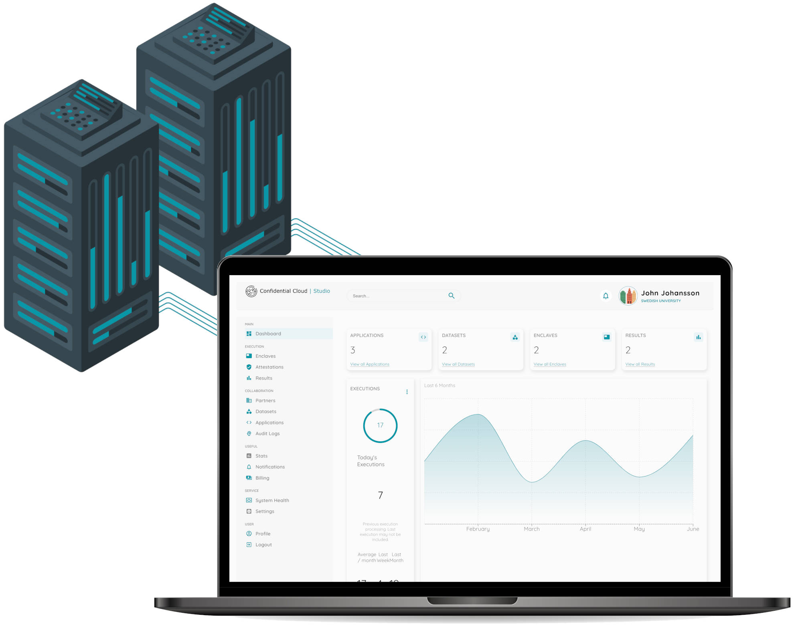

**Hello!**

# Confidential Cloud - Official Documentation

[Confidential Cloud](http://confidentialcloud.io) is CanaryBit's PaaS solution for **Businesses** and **Public Authorities**, willing to collaborate by sharing and processing their **sensitive** digital assets: data or algorithms.

Run your workloads on secure [infrastructure setups](infrastructure.md) thanks to [Confidential Computing](https://www.canarybit.eu/what-is-confidential-computing-and-why-should-i-care/) and other Privacy Enhancing Technologies (PETs), and get an **auditable report** of the encrypted, execution environment.

{: style="width:80%; display: block; margin: 0 auto;"}

 

## Quickstart

<!-- https://squidfunk.github.io/mkdocs-material/reference/grids/#using-card-grids !-->

-   :material-glasses:{ .lg .middle } __Learn__

    ---

    Get familiar with our solution and its core technology
        
    [:octicons-arrow-right-24:{ .lg .middle } Read more](/architecture)

