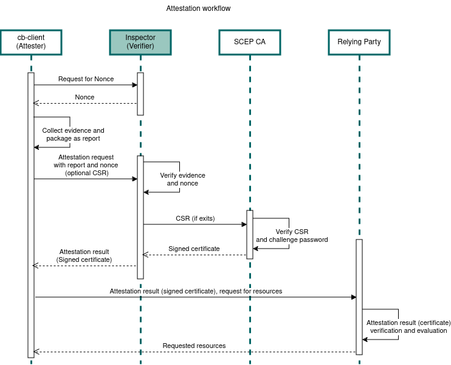

# Verify the security of your infrastructure with Inspector

[Inspector](https://docs.confidentialcloud.io/architecture/#inspector) is CanaryBit's **attestation** service for Confidential Computing setups.

## Attestation Overview
Here we briefly explain a high-level overview of how attestation works within Inspector. Inspector acts as a verifier in a remote attestation architecture [RATS architectire](https://datatracker.ietf.org/doc/rfc9334/). The used terminology here is based on RATS architecture. 

Workload attestation is vital for confidential computing and it verifies the integrity and authenticity of workloads running inside a trusted execution environment (TEE). The successful attestation procedure will estalish the trust between a confidential computing workload and relying parties and ensures that the workload has not been tampered with, compromised, or replaced by malicious code.


Inspector attestation service involves the steps below:

* A confidential computing workload attests its identity and integrity by providing TEE measurements along with other validation data (endorsements) included in attestation report.
* Inspector checks the attestation report against reference values and endorsements to determine its validity and whether specific measurements align with stored values and policies.
* A relying party uses the returned information from Inspector to determine whether to trust the attester or not.

### Verifier

The verifier or Inspector validates, and assesses the attestation evidence. It ensures the integrity and authenticity of workloads by comparing the evidence with stored reference values, endorsements, and policies. Based on these checks, Inspector decides whether the workload is trustworthy and should be allowed to process secure data or application.


### Attester

The attester is a confidential computing environment that must prove its identity and demonstrate that it has not been tampered with or compromised.

We provide a client (CBclient) to streamline the process of obtaining an evidence from the attesting workload. The CBclient uses libraries and tools from AMD to handle low-level platform software calls to obtain the evidence.

The attesting workload is responsible for gathering evidence for the attestaion report, either using the AMD tools or another compatible method. The attestaion report is then sent directly to Inspector (passport model in RATS architecture).


### Relying Party

The relying party which can be data or application owner uses the attestation result returned from Inspector to determine whether to trust the attester and transfer its data or application to the confidential workload. 


## Attestation Security

Inspector uses the following security machanisms to ensure confidentiality, integrity, authenticity, and non-repudiation of attestaion procedure. The used security techniques are described in detail below.   

### Secure Communication

During the attestation procedure, the communication between the attester, verifier, and the relying parties must be secured to protect the confidentiality and integrity of the attestation information. Techniques including encryption and secure communication channel such as TLS are used to establish secure communication. These techniques ensure confientiality and integrity of the acommunication. 

### Nonce
A nonce is a random generated string that uniquely identifies each attestation request. Inspector creates and returns a nonce, which attester use to identify an attestation request. Generated nonces and their creation timestamp are stored on Inspector and each nonce can be only used once within the maximum nonce age. This is to avoid replay attacks that could allow an attacker to reuse the past attestation results.

### Authentication

#### Workload Authentication
The verifier must be able to authenticate the identity of the attester, ensuring that the evidence is coming from the correct source (e.g., a trusted platform or device). The attestation evidence is often signed using digital signatures, ensuring that the verifier can authenticate the origin of the evidence and confirm that it has not been tampered with. 

#### Optional Client Authentication
The attestaion request to the Inspector can include a Certificate Signing Request (CSR) that can be used by a Certificate Authority (CA) to issue digital certificates for client authentication. 
Steps Involved in Using a CSR for client authentication are:

* CBclient first generates a key pair: a public key and a private key.
* CBclient creates a CSR that includes, the client’s public key, identifying information about the client and a signature created using the client’s private key.
* CBclient sends the CSR along with the attestation request to the Inspector. 
* Inspector sends the CSR to the specified CA on behalf of the CBclient using Simple Certificate Enrollment Protocol (SCEP), SCEP is a protocol designed to facilitate the secure issuance of certificates. CSR is submitted along with an optional authentication secret (e.g., a pre-shared key or password) to authenticate the request. This is known as the SCEP challenge password.
* The SCEP CA verifies the CSR by checking the validity of the client’s public key and the digital signature created using the private key. It also checks if the CBclient is authorized to request a certificate (e.g. based on the challenge password).
* If the CSR is valid and the CBclient is authorized, the CA issues the CBclient certificate and resturns it to the Inspector.
* Inspector forwards the signed certificate from the SCEP CA server to the CBclient.
* CBclient then can use the singed certificate to request resources. 

## Attestation FLow
Inspector attestion workflow is represted in the figure below which is based on passport model in RATS architecture: 




As shown in the picture above the attestation flow is as follows: 
1. Data or application owners (relying party) need to get a valid evidence from TEE to make sure it is authentic and trustworthy. CBclient uses AMD tools to get an evidence from TEE. The attester collects evidence, add nonce, extra data, and optional CSR and sends it to inspetor. 
2. Inspector verifies evidence, nonce and applies policies. 
3. If CSR in included in the request, Inspector sends the CSR to SCEP CA server. SCEP CA server verifies the CSR and challenge password and returns a signed certificate. 
4. Inspector sends back attestaion results and signed certificate to the CBclient.
5. CBclient forwards the attestation results and signed certificate to the relying party. The relying party verifies the attestation results and then decides if it should trust the attester or not to transfer its own data or application to the TEE.


## Attestation Policies
Inspector uses attestation policies to perform tests to the evidence or endorsments during attestation verification. Relying party defines these optional attestation policies and the policies will be included in the request to Inspector from CBcleint. By default, Inspector returns an attestation result when no policies have been specified, but if policies are defined, Inspector checks evidnece claims or endorsments against policies.   
Inspector uses OPA which is an open source, general-purpose policy engine that unifies policy enforcement across the stack. OPA provides a high-level declarative language that lets data or application owners to specify policy as code and simple APIs to offload policy decision-making from the software. OPA policies are expressed in a high-level declarative language called Rego, for more information about Rego policy language check [the basics](https://www.openpolicyagent.org/docs/latest/policy-language/#the-basics). As an example, a policy can compare the kernel or OS version of the workload to determine if they have the defined values and then set the policy result. 

### Claims

In attestation report a claim is a name:value pair. Claims contains specific values related to the attested TEE. These elements are associated with the TEE’s hardware and software components which is known as the Trusted-Compute Base (TCB). The software component collects evidence from the TEE and package it as a report. 

## GPU Attestation
Inspector has support for remote attestaion of NVIDIA H100 GPU TEE. The concept of a GPU in Trusted Execution Environment (TEE) is relatively new and enhances the capabilities of a traditional CPU TEE. There are many reosurce intensive applications including AI and amchine learning that require the performance boost provided by GPU hardware acceleration. Many AI models and parameters usually include sensitive data and a confidential GPU offers a secure environment for these workloads, ensuring protection against unauthorized access or tampering.

The GPU itself does not constitute a full TEE for confidential computing and it depends on a confidential CPU TEE. The CPU TEE provides the necessary measurements and attestations to establish trust in the GPU. The CPU TEE securely transfers information to the GPU via a fully encrypted channel. The GPU and the confidential VM exchange keys to create a secure, encrypted communication channel.

### GPU Attestation Flow
To be defined. 

## Supported Trusted Execution Environments
The following TEEs are currently supported.

### AMD SEV-SNP (Secure Encrypted Virtualization - Secure Nested Paging)
AMD SEV-SNP is the latest security feature in AMD's EPYC processors designed to protect virtualized environments, especially in cloud and multi-tenant environments. SEV-SNP builds upon previous AMD security technologies like SEV and SEV-ES to deliver stronger protections against a broader range of attacks.

The AMD SEV-SNP evidence contains the following fields.

- options--SNP validation options, "DEFAULT" or "HYPERV" (Azure/Hyper-V special case).
- evidence--Attestation report binary file, as Base64-encoded string.
- vcek--VCEK (Versioned Chip Endorsement Key) certificate file, as Base64-encoded string.
- ark--ARK (Attestation Root Key) cerfificate file, as Base64-encoded string.
- ask--ASK (Attestation Signing Key) cerfificate file, as Base64-encoded string.

```
{
  "options": "string",
  "evidence": "string",
  "vcek": "string",
  "ark": "string",
  "ask": "string",
}

```

#### Attestaion Report and Claims 
AMD SEV-SNP attestaion report contians the following claims: 

| Claim names        | Description                                                                              |
| -------------      | ---------------------------------------------------------------------------------------- |
| Version            | Version number of the attestation                                                        |
| Policy             | The guest policy is an 8-byte structure with the fields below                            |
|                      Debugging Allowed → Debugging is allowed or not.                                         |
|                      Migration Agent Allowed → Association with a migration agent is allowed or not.          |
|                      SMT Allowed → SMT (Simultaneous Multi-Threading) is allowed or not.                      |
|                      Min. ABI Major → The minimum ABI (Application Binary Interface) major version required.  |
|                      Min. ABI Minor → The minimum ABI (Application Binary Interface) minor version required   |
| Family ID          | Family ID of the guest, provided by the guest owner and uninterpreted by the firmware.   |
| Image ID           | Image ID of the guest, provided by the guest owner and uninterpreted by the firmware.    |
| VMPL               | Virtual Machine Privilege Level (VMPL) is an optional feature in the SEV-SNP architecture| 
|                      which allows a guest VM to divide its address space into four levels.                    |
|                      The level can be used to provide the hardware isolated abstraction layers with a VM.     |
|                      The VMPL 0 is the highest privilege, and VMPL 3 is the least privilege.                  |
| Signature Algorithm| The signature algorithm used to sign the report(The default is ECDSA P-384 with SHA-384).|
| Platform Info      | Information about the platform such as                                                   |
|                      SMT Enabled → Indicates that SMT (Simultaneous Multi-Threading) is enabled in the system.|
|                      Author Key Enabled → Indicates whether an Author key signed the ID key.                  |
| Report Data        | The hash of guest provided data.                                                         |
| Measurement        | Signature of the memory contents at VM launch, can be sent to the guest owner as         |
|                      an attestation that the memory was encrypted correctly by the firmware.                  |
| Host Data          | Data provided by the hypervisor during launch the guest VM, the default is zero.         |
| ID Key Digest      | SHA-384 digest of the ID public key that signed the ID block provided during launch.     |
|                      Specifies the identity of guest owner.                                                   |
| Author Key Digest  | SHA-384 digest of the Author public key that certified the ID key,                       |
|                      if provided during launch. Zeroes if Author Key is Enabled.                              |
| Report ID          | Report identifier of the guest VM.                                                       |
| Migration Agent    | Report identifier of the guest VM’s migration agent.                                     |
| Report ID
| Reported TCB       | Reported Trusted computing base (TCB) version of the SNP firmware used to derive         |
|                      the VCEK (Versioned Chip Endorsement Key) that signed the report.                        |
|                      It contains the following values:                                                        |
|                      Boot Loader SVN → Current bootloader version.                                            |
|                      TEE SVN → Security Version Number (SVN) of PSP (Platform Security Processor) OS          |
|                      SNP firmware SVN → Security Version Number (SVN) of SNP firmware.                        |
|                      Microcode SVN → Lowest current patch level of all cores                                  |
| Chip ID            | CPU ID                                                                                   |
| Signature          | In ECDSA is the signature is built of (R,S),                                             |
|                    | the values below specifies each component value.                                         |
|                    | R → R part of the signature.                                                             |
|                    | S → S part of the signature.                                                             |


#### Evidence Verification

* Attestation report verification
Inspector verifies that the attestation report is valid and was signed by the submitted VCEK certificate.

* Certificate chain verification
Inspector verifies the submitted certificate chain. The verified certificate chain can have one of the following formats.

- AMD ARK, ASK, and VCEK (Versioned Chip Endorsement Key)

```
  +----------------------+
  | Attestation Root Key  | 
  |       (ARK)           |
  +----------------------+
            |
  +----------------------+
  | Attestation Signing   | <-- Signed by ARK, used by PSP to sign reports
  |       Key (ASK)       |
  +----------------------+
            |
  +----------------------+
  |  Versioned Chip       | <-- Signed by ASK, includes platform and VM state
  | Endorsement Key (VCEK)|
  +----------------------+
            |
  +----------------------+
  |  SEV-SNP Attestation  | <-- Signed by VCEK
  |        Report         |
  +----------------------+
```

- AMD ARK, ASVK, and VLEK (Versioned Loaded Endorsement Key)

```
 +----------------------+
  | Attestation Root Key  | 
  |       (ARK)           |
  +----------------------+
            |
  +----------------------+
  | Attestation Signing   | <-- Signed by ARK, used by PSP to sign reports
  |       Key (ASK)       |
  +----------------------+
            |
  +----------------------+
  |  Versioned Loaded     | <-- Signed by ASK, includes platform and VM state
  | Endorsement Key (VLEK)|
  +----------------------+
            |
  +----------------------+
  |  SEV-SNP Attestation  | <-- Signed by VLEK
  |        Report         |
  +----------------------+
```

* Measurement evidence claim verification 
Inspector verifies if the measurement value contained in the attestation report is equal to the reference value calculated by using the [sev-snp-measure tool](https://github.com/virtee/sev-snp-measure).

- Report data evidence claim verification
 Inspector verifies if the hash of additional report data is included in the attestation report is equal to the hash of the report data computed by Inspector (skipped for Azure/Hyper-V).


### Intel TDX
- To be defined.

### NVIDIA GPU
NVIDIA GPU Confidential Computing is an initiative that enables secure processing of sensitive data and application on GPUs, ensuring that the data or applicaton remains protected during computation.

The verification for the NVIDIA GPU attestation request is performed using the [GPU attestation tool](https://github.com/canarybit/gpu-attestation).

The GPU report contains the following fields.

- nonce--Request nonce, generated by Inspector for each request.
- arch--GPU architecture.
- driver_version--List of driver versions for each attested GPU.
- vbios_version--List of VBIOS versions for each attested GPU.
- evidence--List of evidence gathered for each attested GPU, with the following contents:
    * certChainBase64Encoded--Certificate chain, encoded as Base64 string.
    * attestationReportHexStr--Attestation report, encoded as hex string.
```
{
  "nonce": "string",
  "arch": "string",
  "driver_version": [
    "string"
  ],
  "vbios_version": [
    "string"
  ],
  "evidence": [
    {
      "certChainBase64Encoded": "string",
      "attestationReportHexStr": "string"
    }
  ]
}
```
