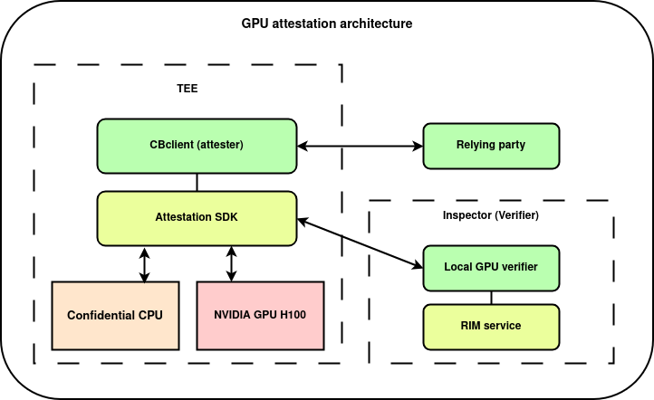

# Verify the security of your infrastructure with Inspector

[Inspector](https://docs.confidentialcloud.io/architecture/#inspector) is CanaryBit's **attestation** service for Confidential Computing setups.

## Attestation Overview
We start with a high-level overview of how Inspector performs attestation.
We use the [RFC 9334](https://datatracker.ietf.org/doc/rfc9334/) RATS (Remote ATtestation procedureS) architecture terminology throughout all documentation.
Inspector performs the role of a verifier in the RATS architecture. 


Attestation is a core concept in confidential computing.
It is a process where one peer (the "Attester") produces believable information about itself ("Evidence") to enable a
remote peer (the "Relying Party") to decide whether to  consider that the Attester is a trustworthy peer.
Remote attestation procedures are facilitated by Inspector, performing the role of a verifier.
The successful attestation procedure helps establish a trust relationship between the attester (such as a confidential computing environment which is usually a VM (Virtual Machine) that has support for TEE (Trusted Execution Environment)) and relying parties.
CanaryBit supports confidential computing environments instantiated as confidential virtual machines confidential containers.
Attestation helps assure third parties that the confidential computing environments has not been tampered with or otherwise compromised.

* A confidential computing environment attests its identity and integrity by providing Evidence along with other validation data (endorsements) included in an evidence.
* Inspector checks the evidence against reference values and endorsements to determine its validity and whether specific measurements align with stored values and policies.
* A relying party uses the returned information from Inspector to determine whether to trust the attester or not.

### Inspector

CanaryBit Inspector validates and assesses the evidence. 
It further ensures the integrity and authenticity of attesters by comparing the evidence with stored reference values, endorsements, and policies. 
Based on these checks, Inspector produces information helping third party assess whether a specific attester is trustworthy and should be permitted to access resources.


### Attester

The attester is a confidential computing environment capable to provide evidence to that can be used to assess its trustworthiness.

CanaryBit provides a client software (**cb-client**) to streamline the process of obtaining an evidence from the attesting environment. 
**cb-client** uses firmware and software support from platform vendors (AMD, Intel, NVIDIA, AMD, and others) to invoke low-level platform calls in order to obtain the evidence.
The evidence is then sent to Inspector for validation, corresponding to the "passport model" in RATS architecture.


### Relying Party

The relying party or resource owner uses the attestation result returned from Inspector to determine whether to trust the attester and transfer its resource to the confidential environment.

## Attestation Security

Inspector uses the following security machanisms to ensure confidentiality, integrity, authenticity, and non-repudiation of attestation procedure. The used security techniques are described in detail below.

### Secure Communication

During the attestation procedure, the communication between the attester, Inspector, and the relying parties must be secured to protect the confidentiality and integrity of the attestation information. Techniques including encryption and secure communication channel such as TLS are used to establish secure communication. These techniques ensure confientiality and integrity of the acommunication. 

### Nonce
A nonce is a random generated string that uniquely identifies each attestation request. Inspector creates and returns a nonce, which attester use to identify an attestation request. Generated nonces and their creation timestamp are stored on Inspector and each nonce can be only used once within the maximum nonce age. This is to avoid replay attacks that could allow an attacker to reuse the past attestation results.

### Authentication

#### Confidential Computing Environment Authentication
Inspector must be able to authenticate the identity of the attester, ensuring that the evidence is coming from the correct source (e.g., a trusted platform or device). The attestation evidence is often signed using digital signatures, ensuring that Inspector can authenticate the origin of the evidence and confirm that it has not been tampered with. 

#### Optional Client Authentication
The attestation request to the Inspector can include a Certificate Signing Request (CSR) that can be used by a Certificate Authority (CA) to issue digital certificates for client authentication.
Steps Involved in using a CSR for client authentication are:

* cb-client first generates a key pair: a public and a private key.
* cb-client creates a CSR that includes, the client’s public key, identifying information about the client and a signature created using the client’s private key.
* cb-client sends the CSR along with the attestation request to the Inspector. 
* Inspector sends the CSR to the specified CA on behalf of the cb-client using Simple Certificate Enrollment Protocol (SCEP), SCEP is a protocol designed to facilitate the secure issuance of certificates. CSR is submitted along with an optional authentication secret (e.g., a pre-shared key or password) to authenticate the request, which is known as the SCEP challenge password.
* The SCEP CA verifies the CSR by checking the validity of the client’s public key and the digital signature created using the private key. It also checks if the cb-client is authorized to request a certificate (e.g. based on the challenge password).
* If the CSR is valid and the cb-client is authorized, the CA issues the cb-client certificate and resturns it to the Inspector.
* Inspector forwards the signed certificate from the SCEP CA server to the cb-client.
* cb-client then can use the singed certificate to request resources. 

## Attestation FLow
Inspector attestion workflow is represted in the figure below which is based on passport model in RATS architecture: 


As shown in the picture above the attestation flow is as follows: 
1. Resource owners (relying party) need to get a valid evidence from confidential computing environment to make sure it is authentic and trustworthy. cb-client uses AMD, Intel, and NVIDIA (based on the used confidential computing environment) tools to get an evidence from confidential computing environment. The attester collects evidence, add nonce, extra data, and optional CSR and sends it to inspetor. 
2. Inspector verifies evidence, nonce and applies policies. 
3. If CSR in included in the request, Inspector sends the CSR to SCEP CA server. SCEP CA server verifies the CSR and challenge password and returns a signed certificate. 
4. Inspector sends back attestation results and signed certificate to the cb-client.
5. cb-client forwards the attestation results and signed certificate to the relying party. The relying party verifies the attestation results and then decides if it should trust the attester or not to transfer its own resource to the confidential computing environment.


## Attestation Policies
Inspector uses attestation policies to perform tests to the evidence or endorsments during attestation verification. Relying party defines these optional attestation policies and the policies will be included in the request to Inspector from cb-client. By default, Inspector returns an attestation result when no policies have been specified, but if policies are defined, Inspector checks evidnece claims or endorsments against policies.   
Inspector uses OPA which is an open source, general-purpose policy engine that unifies policy enforcement across the stack. OPA provides a high-level declarative language that lets resource owners to specify policy as code and simple APIs to offload policy decision-making from the software. OPA policies are expressed in a high-level declarative language called Rego, for more information about Rego policy language check [the basics](https://www.openpolicyagent.org/docs/latest/policy-language/#the-basics). As an example, a policy can compare the kernel or OS version of the VM to determine if they have the defined values and then set the policy result. 

### Claims

In an evidence a claim is a name:value pair. Claims contains specific values related to the attested confidential computing environment. These elements are associated with the confidential computing environment’s hardware and software components which is known as the Trusted-Compute Base (TCB). The software component collects evidence from the confidential computing environment and package it as a report. 

## GPU Attestation
Inspector supports remote attestation of NVIDIA H100 GPU confidential computing environments. The concept of a GPU in confidential computing environment is relatively new and enhances the capabilities of a traditional CPU TEE. There are many reosurce intensive applications including AI and amchine learning that require the performance boost provided by GPU hardware acceleration. Many AI models and parameters usually include sensitive data and a confidential GPU offers a secure environment for these workloads, ensuring protection against unauthorized access or tampering.

The GPU itself does not constitute a full confidential computing environment for confidential computing and it depends on a confidential CPU TEE. The CPU TEE provides the necessary measurements and attestations to establish trust in the GPU. The CPU TEE securely transfers information to the GPU via a fully encrypted channel. The GPU and the confidential computing environment exchange keys to create a secure, encrypted communication channel. Currently there are three specific CPUs that can be used to enable confidential compute with NVIDIA’s H100:
* Intel CPUs with support of Trusted Domain eXtensions (TDX)
* AMD CPUs with support of Secure Encrypted Virtualization with Secure Nested Paging (SEV-SNP)
* ARM CPUs with support of ARM Confidential Compute Architecture (CCA)
For more information about CPU and GPU memory communications refer to [Confidential Compute on NVIDIA Hopper H100](https://images.nvidia.com/aem-dam/en-zz/Solutions/data-center/HCC-Whitepaper-v1.0.pdf). 

### GPU Attestation Flow
GPU attestation is the process where the relying party wants to challenge the GPU hardware and the associated driver, firmware, and microcode, and receives confirmation that the results are valid and authentic. In Inspector we use a local GPU verifier. 

The GPU attestation flow is shown in the picture below:



Here are the general steps for the attestation workflow using the Inspector: 
* Relying party requests the attester to attest GPU and the attester sends the attestation request to Inspector
* Inspector generates a random nonce and sends the nonce to the attester to get a measurement of the GPU using the NVIDIA libraries (cc_admin/nvml). 
* The attester uses NVIDIA Attestation SDK to attest the GPU and it includes the nonce in the endorsed evidence.
The evidence is signed with a private key known as the Attestation Key (AK), and the corresponding public key is provided in a certificate to verify the signature on the evidence. For a GPU, the AK is deterministically generated during each full chip reset. A certificate is issued for the AK and signed by a unique device identity key specific to that device. The certificate chain includes one or more intermediate certificates above the identity key to establish trust in the AK. Attester sends the evidence to Inspector.
* Inspector verifies the nonce and uses the local GPU verifier to check the endorsed evidence with the device identity and attestation key
certificates. 
* The local GPU verifier parse the evidence and validates it. It validates the evidence endorsement certificate chain.
If any of the certificates in the certificate chain is revoked, local GPU verifier will return an
evidence is not valid message. Local GPU verifier also validates the signature of the evidence using the public key from the verified
certificate chain and it also checks if the issuer of the certificate chain belongs to NVIDIA PKI. If the signature of the evidence is not able to be verified, and an error will be generated and the attestation validation will be stoped.
* The Local GPU verifier fetches RIM Bundle (Golden Measurements) from RIM Service for the device using the driver-version and GPU model provided in the evidence. Any exception from the RIM service will result in GPU attestation failure.
* The local GPU verifier, validates the signature of the RIM bundle against the public certificate. It also compares the evidence with the Golden measurement fetched from RIM service and creates attestation result and sends back the attestation result to the relying party.


## Supported Confidential Computing Environments
The following confidential computing environments are currently supported.

### AMD SEV-SNP (Secure Encrypted Virtualization - Secure Nested Paging)
AMD SEV-SNP is the latest security feature in AMD's EPYC processors designed to protect virtualized environments, especially in cloud and multi-tenant environments. SEV-SNP builds upon previous AMD security technologies like SEV and SEV-ES to deliver stronger protections against a broader range of attacks.

The AMD SEV-SNP evidence contains the following fields.

- options--SNP validation options, "DEFAULT" or "HYPERV" (Azure/Hyper-V special case).
- evidence--Attestation report binary file, as Base64-encoded string.
- vcek--VCEK (Versioned Chip Endorsement Key) certificate file, as Base64-encoded string.
- ark--ARK (Attestation Root Key) cerfificate file, as Base64-encoded string.
- ask--ASK (Attestation Signing Key) cerfificate file, as Base64-encoded string.

```
{
  "options": "string",
  "evidence": "string",
  "vcek": "string",
  "ark": "string",
  "ask": "string",
}

```

#### Evidence and Claims
AMD SEV-SNP evidence contains the following claims:


| Claim names                     | Description                                                                                                                                                                                                                                                                                                                                                                                                                                                                                          |
|---------------------------------|------------------------------------------------------------------------------------------------------------------------------------------------------------------------------------------------------------------------------------------------------------------------------------------------------------------------------------------------------------------------------------------------------------------------------------------------------------------------------------------------------|
| Version                         | Version number of the attestation                                                                                                                                                                                                                                                                                                                                                                                                                                                                    |
| Policy                          | The guest policy is an 8-byte structure with the fields below  <br />  Debugging Allowed → Debugging is allowed or not. <br />  Migration Agent Allowed → Association with a migration agent is allowed or not. <br />  SMT Allowed → SMT (Simultaneous Multi-Threading) is allowed or not.  <br/>    Min. ABI Major → The minimum ABI (Application Binary Interface) major version required. <br />   Min. ABI Minor → The minimum ABI (Application Binary Interface) minor version required <br /> |
| Family ID                       | Family ID of the guest, provided by the guest owner and uninterpreted by the firmware.                                                                                                                                                                                                                                                                                                                                                                                                               |
| Image ID                        | Image ID of the guest, provided by the guest owner and uninterpreted by the firmware.                                                                                                                                                                                                                                                                                                                                                                                                                |
| VMPL                            | Virtual Machine Privilege Level (VMPL) is an optional feature in the SEV-SNP architecture <br />  which allows a guest VM to divide its address space into four levels. <br /> The level can be used to provide the hardware isolated abstraction layers with a VM.<br /> The VMPL 0 is the highest privilege, and VMPL 3 is the least privilege.                                                                                                                                                    |
| Signature Algorithm             | The signature algorithm used to sign the report(The default is ECDSA P-384 with SHA-384).                                                                                                                                                                                                                                                                                                                                                                                                            |
| Platform Info                   | Information about the platform such as  <br /> SMT Enabled → Indicates that SMT (Simultaneous Multi-Threading) is enabled in the system. <br />   Author Key Enabled → Indicates whether an Author key signed the ID key.                                                                                                                                                                                                                                                                            |
| Report Data                     | The hash of guest provided data.                                                                                                                                                                                                                                                                                                                                                                                                                                                                     |
| Measurement                     | Signature of the memory contents at VM launch, can be sent to the guest owner as <br /> an attestation that the memory was encrypted correctly by the firmware.                                                                                                                                                                                                                                                                                                                                      |
| Host Data                       | Data provided by the hypervisor during launch the guest VM, the default is zero.                                                                                                                                                                                                                                                                                                                                                                                                                     |
| ID Key Digest                   | SHA-384 digest of the ID public key that signed the ID block provided during launch. <br />Specifies the identity of guest owner.                                                                                                                                                                                                                                                                                                                                                                    |
| Author Key Digest               | SHA-384 digest of the Author public key that certified the ID key, <br /> if provided during launch. Zeroes if Author Key is Enabled.                                                                                                                                                                                                                                                                                                                                                                |
| Report ID                       | Report identifier of the guest VM.                                                                                                                                                                                                                                                                                                                                                                                                                                                                   |
| Migration Agent <br />Report ID | Report identifier of the guest VM’s migration agent.                                                                                                                                                                                                                                                                                                                                                                                                                                                 |
| Reported TCB                    | Reported Trusted computing base (TCB) version of the SNP firmware used to derive <br /> the VCEK (Versioned Chip Endorsement Key) that signed the report. <br /> It contains the following values: <br /> Boot Loader SVN → Current bootloader version. <br /> TEE SVN → Security Version Number (SVN) of PSP (Platform Security Processor) OS  <br /> SNP firmware SVN → Security Version Number (SVN) of SNP firmware. <br />  Microcode SVN → Lowest current patch level of all cores             |
| Chip ID                         | CPU ID                                                                                                                                                                                                                                                                                                                                                                                                                                                                                               |
| Signature                       | In ECDSA is the signature is built of (R,S), <br /> the values below specifies each component value.  <br />  R → R part of the signature. <br /> S → S part of the signature.                                                                                                                                                                                                                                                                                                                       |


#### Evidence Verification

* Evidence verification
Inspector verifies that the evidence is valid and was signed by the submitted VCEK certificate.

* Certificate chain verification
Inspector verifies the submitted certificate chain. The verified certificate chain can have one of the following formats.

- AMD ARK, ASK, and VCEK (Versioned Chip Endorsement Key)

```
  +----------------------+
  | Attestation Root Key  | 
  |       (ARK)           |
  +----------------------+
            |
  +----------------------+
  | Attestation Signing   | <-- Signed by ARK, used by PSP to sign reports
  |       Key (ASK)       |
  +----------------------+
            |
  +----------------------+
  |  Versioned Chip       | <-- Signed by ASK, includes platform and VM state
  | Endorsement Key (VCEK)|
  +----------------------+
            |
  +----------------------+
  |  SEV-SNP Attestation  | <-- Signed by VCEK
  |        Report         |
  +----------------------+
```

- AMD ARK, ASVK, and VLEK (Versioned Loaded Endorsement Key)

```
 +----------------------+
  | Attestation Root Key  | 
  |       (ARK)           |
  +----------------------+
            |
  +----------------------+
  | Attestation Signing   | <-- Signed by ARK, used by PSP to sign reports
  |       Key (ASK)       |
  +----------------------+
            |
  +----------------------+
  |  Versioned Loaded     | <-- Signed by ASK, includes platform and VM state
  | Endorsement Key (VLEK)|
  +----------------------+
            |
  +----------------------+
  |  SEV-SNP Attestation  | <-- Signed by VLEK
  |        Report         |
  +----------------------+
```

* Measurement evidence claim verification 
Inspector verifies if the measurement value contained in the evidence is equal to the reference value calculated by using the [sev-snp-measure tool](https://github.com/virtee/sev-snp-measure).

- Report data evidence claim verification
 Inspector verifies if the hash of additional report data is included in the evidence is equal to the hash of the report data computed by Inspector (skipped for Azure/Hyper-V).


### Intel TDX
Intel Trust Domain Extensions (Intel TDX) is currently the newest confidential computing technology by Intel. TDX facilitates the deployment of trust domains (TD), which are hardware-isolated VMs designed to protect sensitive data and applications from unauthorized access.
Intel TDX uses hardware extensions for encrypting memory and protects both the confidentiality and integrity of the TDs. 

#### Evidence and Claims
In TDX, remote attestation allows external entities to verify the integrity of the system and that the TD has been securely established. 
In TDX, an evidence is represented as a JSON Web Token (JWT) issued by the attester and contains the results of an attestation request. The token is composed of a header, a body, and an attestation signature. The token body, is the main part of the JWT that contains all the claims from confidential computing environment. 
The attestation token claims in TDX are shown below: 

| Claim names                      | Description                                                                                                                                                                                                  |
|----------------------------------|--------------------------------------------------------------------------------------------------------------------------------------------------------------------------------------------------------------|
| tdx_mrsignerseam                 | The measurement of the Intel TDX module signer, if valid.                                                                                                                                                    |
| tdx_mrseam                       | The measurement of the Intel TDX module.                                                                                                                                                                     |
| tdx_mrtd                         | The measurement of the TD build process and the initial contents of the TD.                                                                                                                                  |
| tdx_seamsvn                      | The Intel TDX module security version number (SVN).                                                                                                                                                          |
| tdx_rtmr0                        | The measurement of the TD virtual firmware (TDVF) configuration.                                                                                                                                             |
| tdx_rtmr1                        | The measurements of the TD OS loader and kernel.                                                                                                                                                             |
| tdx_rtmr2                        | The measurement of the OS application.                                                                                                                                                                       |
| tdx_rtmr3                        | Reserved for special usage.                                                                                                                                                                                  |
| tdx_mrconfigid                   | The software-defined ID for non-owner-defined configuration of the TD.                                                                                                                                       |
| tdx_mrowner                      | The software-defined ID for the TD’s owner.                                                                                                                                                                  |
| tdx_mrownerconfig                | The software-defined ID for owner-defined configuration of the TD.                                                                                                                                           |
| tdx_report_data                  | This claim contains the hash of the nonce supplied with the evidence, runtime_data supplied during quote generation, optional user data, and attester held data supplied by the TEE during quote generation. |
| tdx_seam_attributes              | Additional configuration of the Intel TDX module.                                                                                                                                                            |
| tdx_td_attributes                | The TD attributes bitmap. This claim contains the entire bitmap. The following claims break out certain specific attributes specified in the bitmap.                                                         |
| tdx_td_attributes_debug          | Defines whether the TD runs in TD debug mode (set to 1) or not (set to 0).                                                                                                                                   |
| tdx_td_attributes_key_locker     | This claim indicates if the TD is allowed to use Intel Key Locker hardware resources for AES key protection.                                                                                                 |
| tdx_td_attributes_perfmon        | TD is allowed to use Perfmon and PERF_METRICS capabilities.                                                                                                                                                  |
| tdx_attributes_protection_keys   | TD is allowed to use Supervisor Protection Keys.                                                                                                                                                             |
| tdx_td_attributes_septve_disable | The TD is allowed to use Supervisor Protection Keys.                                                                                                                                                         |
| tdx_tee_tcb_svn                  | Describes the TCB SVNs of TDX.                                                                                                                                                                               |
| tdx_xfam                         | Contains an XFAM mask of CPU extended features that the TD is allowed to use.                                                                                                                                |
| tdx_is_debuggable                | This claim indicates if the Intel TDX debug attribute is enabled or not. True if enabled, otherwise false.                                                                                                   |
| tdx_collateral                   | Contains the hash value of the binary TCB collateral being used to verify the the quote.                                                                                                                     |

For more information about the claims and JWT token from Intel TDX refer to [Intel TDX document](https://download.01.org/intel-sgx/latest/dcap-latest/linux/docs/Intel_TDX_DCAP_Quoting_Library_API.pdf)

#### Evidence Verification

Inspector uses Intel attestation service to verify the TDX attestation token or quote, and the attestation service performs the following checks on the quote: 

* Check the PCK (Provisioning Certification Key) Cert (signature chain).
* Check if the PCK Cert is on the CRL (Certificate Revocation Lists).
* Check the verification collaterals’ cert signature chain, including PCK Cert Chain, TCB info chain and QE (Quoting Enclave) identity chain.
* Check if verification collaterals are on the CRL.
* Check the TDQE Report signature and the contained AK (Attestation Key) hash using the PCK Cert.
* Check the measurements of the TDQE contained in the TDQE Report.
* Check the signature of the TD Quote using the public key–part of the AK. Implicitly, this validated the TD and TDX (Trust Domain Extensions) Module measurements.
* Evaluate the TDX TCB information contained in the TD Quote.


### NVIDIA GPU
NVIDIA GPU Confidential Computing is an initiative that enables secure processing of sensitive data and application on GPUs, ensuring that the data or applicaton remains protected during computation.

The verification for the NVIDIA GPU attestation request is performed using the [GPU attestation tool](https://github.com/canarybit/gpu-attestation).

The GPU report contains the following fields.

- nonce--Request nonce, generated by Inspector for each request.
- arch--GPU architecture.
- driver_version--List of driver versions for each attested GPU.
- vbios_version--List of VBIOS versions for each attested GPU.
- evidence--List of evidence gathered for each attested GPU, with the following contents:
    * certChainBase64Encoded--Certificate chain, encoded as Base64 string.
    * attestationReportHexStr--Attestation report, encoded as hex string.
```
{
  "nonce": "string",
  "arch": "string",
  "driver_version": [
    "string"
  ],
  "vbios_version": [
    "string"
  ],
  "evidence": [
    {
      "certChainBase64Encoded": "string",
      "attestationReportHexStr": "string"
    }
  ]
}
```
#### Evidence and Claims

The GPU evidence is collected by the NVIDIA GPU driver running on the server where the GPU is installed. The collected evidence has binary format and it usually contains the following claims.

| Claim names                   | Description                                                                           | 
|-------------------------------|---------------------------------------------------------------------------------------|
| sub                           | Identifies the type of attestation (e.g., NVIDIA GPU).                                |  
| aud                           | The target audience, such as "HOPPER," indicating the hardware generation of the GPU. |  
| nonce                         | A cryptographic nonce to protect against replay attacks.                              |  
| exp                           | Timestamps indicating the expiration time of the evidence.                            |  
| iat                           | Timestamps indicating the issuance of the evidence.                                   |  
| jti                           | A unique identifier that enables traceability and correlation.                        |  
| x-nv-gpu-driver-version       | Indicates the specific driver version installed.                                      |  
| x-nv-gpu-vbios-version        | Indicates the specific VBIOS version installed.                                       |  
| x-nv-attestation-manufacturer | Provides the manufacturer information.                                                |  
| x-nv-attestation-type         | Specifies the type of attestation, in this case, for a GPU.                           |  
| evidenceCertificate           | The certificate chain included in the evidence.                                       |  
| evidenceSignature             | The digital signature included in the evidence.                                       |  
| runtimeMeasurement            | Includes the runtime measurements from the GPU.                                       |  

The GPU evidence includes opaque evidence data, where each field ID represents specific metadata or status about the hardware. Here's what each ID typically represents:


| Claim names                                       | Description                                                                                                     |
|---------------------------------------------------|-----------------------------------------------------------------------------------------------------------------|
| **OPAQUE_FIELD_ID_CERT_ISSUER_NAME**              | The name of the certificate authority that issued the attestation certificate.                                  |
| **OPAQUE_FIELD_ID_CERT_AUTHORITY_KEY_IDENTIFIER** | An identifier for the certificate authority’s key used to sign the certificate.                                 |
| **OPAQUE_FIELD_ID_DRIVER_VERSION**                | The version of the GPU driver currently in use.                                                                 |
| **OPAQUE_FIELD_ID_GPU_INFO**                      | General information about the GPU model, generation, or specifications.                                         |
| **OPAQUE_FIELD_ID_SKU**                           | Stock Keeping Unit, a unique identifier for the hardware model or variant.                                      |
| **OPAQUE_FIELD_ID_VBIOS_VERSION**                 | Version of the VBIOS (Video BIOS) firmware installed on the GPU.                                                |
| **OPAQUE_FIELD_ID_MANUFACTURER_ID**               | Identifies the manufacturer, typically NVIDIA Corporation, as the hardware producer.                            |
| **OPAQUE_FIELD_ID_TAMPER_DETECTION**              | Contains status information about any tamper detection features, indicating if any tampering is detected.       |
| **OPAQUE_FIELD_ID_SMC**                           | Security Management Controller status, relating to secure operations management within the GPU.                 |
| **OPAQUE_FIELD_ID_VPR**                           | Status of Video Protected Region, used in secure video processing.                                              |
| **OPAQUE_FIELD_ID_NVDEC0_STATUS**                 | Status of the NVDEC (NVIDIA Video Decoder) unit, relevant to secure decoding tasks.                             |
| **OPAQUE_FIELD_ID_MSRSCNT**                       | Measurement or resource counter, used for tracking secure measurement operations.                               |
| **OPAQUE_FIELD_ID_CPRINFO**                       | Confidential or secure processing information relevant to attestation or cryptographic handling.                |
| **OPAQUE_FIELD_ID_BOARD_ID**                      | Identifier for the specific board layout or version of the GPU.                                                 |
| **OPAQUE_FIELD_ID_CHIP_SKU**                      | SKU identifier for the chip itself, indicating the specific version of the GPU processor.                       |
| **OPAQUE_FIELD_ID_CHIP_SKU_MOD**                  | Modifier to the chip SKU, giving additional specifics on the chip variant.                                      |
| **OPAQUE_FIELD_ID_PROJECT**                       | Identifies the internal project name or code for the GPU model.                                                 |
| **OPAQUE_FIELD_ID_PROJECT_SKU**                   | SKU of the project, defining variations in the project model.                                                   |
| **OPAQUE_FIELD_ID_PROJECT_SKU_MOD**               | Modifier for the project SKU, for further specification.                                                        |
| **OPAQUE_FIELD_ID_FWID**                          | Firmware identifier, specifying the particular firmware version or type installed.                              |
| **OPAQUE_FIELD_ID_PROTECTED_PCIE_STATUS**         | Status of PCIe (Peripheral Component Interconnect Express) protection, related to secure data handling on PCIe. |
| **OPAQUE_FIELD_ID_INVALID**                       | A placeholder or error field, used when an invalid ID is encountered or when a field is unused.                 |


#### Evidence Verification


 The core checks that commonly applies on NVIDIA's evidence are:
 
 1- Certificate validation: The evidence includes an attestation certificate issued by NVIDIA or a trusted authority. In verification usually the issuer's digital signature on the certificate is verified.
 2- Signature verification: The evidence itself or sections within it are signed using NVIDIA's private key. The verifier uses NVIDIA's public key to verify the signature,
 3- Nonce verification: A nonce generated by the verifier is often included in the attestation request. Validating the nonce ensures the report is fresh and wasn't reused.
 4- Measurement verification: These measurements capture the state of various GPU components, such as firmware and driver versions, and runtime configurations. The verifier compares these measurements against expected values to ensure no tampering has occurred.
 
