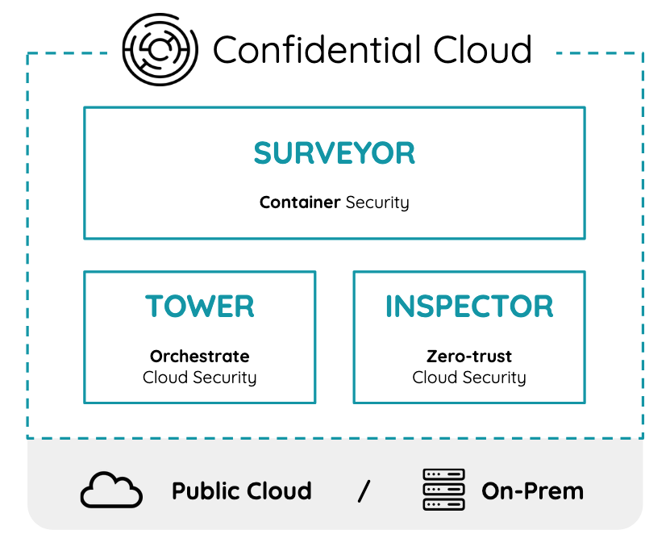

# Overview

Industries across the globe are increasingly recognizing that AI and data analytics are no longer optional add-ons but essential drivers of competitiveness and growth. 

With the explosion of digital information, businesses face the challenge of extracting meaningful insights from massive datasets, something traditional methods simply cannot handle efficiently. 

AI-powered analytics enables organizations to predict consumer behavior, optimize supply chains, detect fraud, personalize customer experiences, and streamline operations with unprecedented accuracy and speed. In sectors like Aerospace & Defence, Healthcare, Finance, Energy, the ability to harness data through AI is directly tied to innovation, cost savings, and long-term sustainability. In short, industries that fail to embrace AI and data analytics risk falling behind in a marketplace that increasingly rewards agility, intelligence, and data-driven decision-making.

However, while AI and data analytics offer enormous potential, they also carry significant *risks* that industries must carefully manage:

- [Security & Privacy]()
- [Compliance]()
- [Legal & IP]()
- [Liability & Reputational]()
- [Societal]()

CanaryBit Confidential Cloud helps mitigate relevant risks ensuring **confidentiality**, **integrity**, and **availability** of sensitive digital assets.

