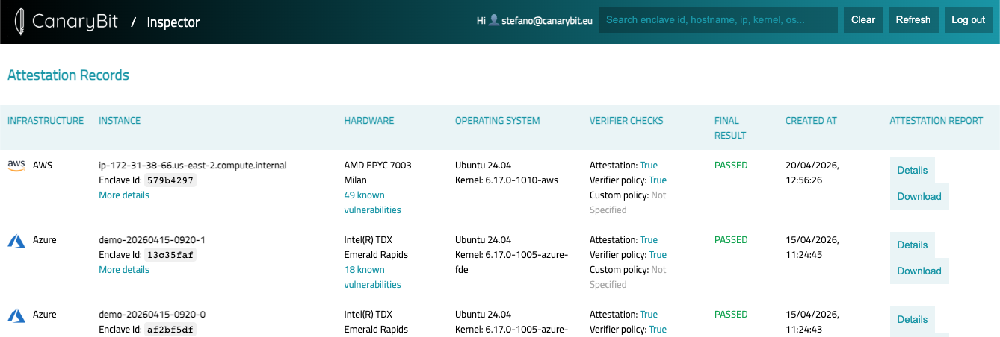
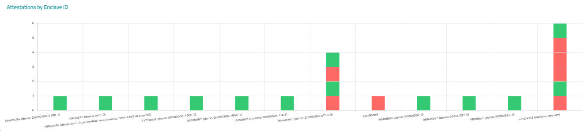

# The Playground

*Get familiar with CanaryBit Confidential Cloud tools for FREE*

---

The playground gives you the opportunity to play and interact with CanaryBit Confidential Cloud tools for Confidential environments deployment on Azure, AWS and GCP.

## Requirements

- A [CanaryBit Inspector Trial licence](http://127.0.0.1:8000/products/inspector/#licences) ("Not For Resale");
- A [CanaryBit account](https://auth.confidentialcloud.io/signup?client_id=54g4h9tpulnnkmhivgn5nipjki&redirect_uri=https%3A%2F%2Finspector.confidentialcloud.io%2F&response_type=code&code_challenge_method=S256&code_challenge=ngK8ZsXEC3A72nogaAmpKpR_LnB5kvCqOvr8z6qDWZI&scope=openid+profile+email);
- An Azure, AWS or GCP account.

## How-To

## 1. Source your credentials

In your terminal, source as environment variables your **CanaryBit** credentials:

``` title="CanaryBit"
export CB_USERNAME=***
export CB_PASSWORD=***
```

as well as your infrastructure provider credentials: 

``` title="Azure"
export ARM_SUBSCRIPTION_ID=***
export ARM_TENANT_ID=***
export ARM_CLIENT_ID=***
export ARM_CLIENT_SECRET=***
```

``` title="AWS"
export AWS_ACCESS_KEY_ID=***
export AWS_SECRET_ACCESS_KEY=***
export AWS_REGION=***
```

``` title="GCP"
export GOOGLE_APPLICATION_CREDENTIALS=***
export GOOGLE_PROJECT=***
export GOOGLE_ZONE=***
```

## 2. Deploy your Confidential environment with CanaryBit Tower

CanaryBit Tower comes with a set of [examples](https://github.com/canarybit/terraform-canarybit-tower/tree/main/examples) that can be used to provision a secure environment in your target infrastructure.  

Download CanaryBit Tower configuration for [Public Cloud deployments](./products/tower.md#public-clouds) and use the example file related to your target infrastructure.  

Finally, deploy the environment following the steps documented in the [Products :: TOWER](./products/tower.md#deploy-verify) page.


## 3. Verify your environment with CanaryBit Inspector

### Automatic Verification 

CanaryBit Tower will automatically perform an attestation of your environment using CanaryBit Inspector SaaS service.

!!! tip

    For more **ad-hoc setups** please [get in touch](https://www.canarybit.eu/contact) with the CanaryBit team. We will be happy to discuss and help you up fullfil your needs.

### View the final report

Simply [log in](https://inspector.confidentialcloud.io) to the CanaryBit Inspector Dashboard to view the final report, monitor and observe the security of your environment.

**List View:**



**Graph View:**



## 4. Need help?

We will be happy to help you up to speed with our Confidential Cloud solution. 

[Contact Support!](https://www.canarybit.eu/contact)

