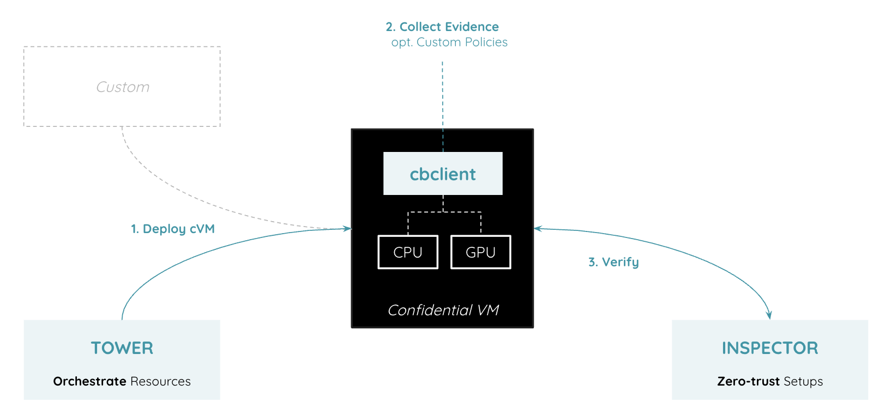

# CanaryBit Inspector

*Audit & Certify Trusted Execution Environments (TEE)*

--- 

**CanaryBit Inspector** is a Confidential Computing [Remote Attestation]() service with extended functionalites, helping end-users to fully verify the security of their processing environments before any sensitive data analysis.

CanaryBit Inspector validates that the underlying platform has support for and uses Confidential Computing capabilties enabled by the platform's instruction set architecture and firmware.
CanaryBit Inspector performs the validation based on an Attestation Report provided by a software client deployed in the TEE. The client software collects information on the hardware, firmware, and software level to attest its trustworthiness. CanaryBit Inspector monitors the infrastructure security and enforces customer-defined deployment policies by destroying infrastructure components that fail to meet custom needs.

## Architecture 
CanaryBit Inspector service is **built on microservices** that wholetogether provide an holistic view on the underlying insfrastructure and technology stack.

- **Core**: the core logic of CanaryBit's Inspector Remote Attestations (RA) service. It verifies the integrity of a processing environment running on hardware with Confidential Computing capabilities. <br>
[https://api.inspector.confidentialcloud.io](https://api.inspector.confidentialcloud.io)

- **Dashboard**: it offers multiple services and functionalities to fine-tune the expected processing environments and collect the final results through a single, unified interface. <br>
[https://dashboard.inspector.confidentialcloud.io](https://dashboard.inspector.confidentialcloud.io)

- **Policy Generator**: it allows end-users to generate and save custom policies to enforce additional constraints on the deployed environments at both hardware, hypervsisor and hypervisor level. <br>
[https://policy.inspector.confidentialcloud.io](https://policy.inspector.confidentialcloud.io)

- **Policy Playground**: it allows end-users to test custom policies against CanaryBit Inspector data schema, ensuring smoother operations and extended verification. <br>
[https://playground.inspector.confidentialcloud.io](https://playground.inspector.confidentialcloud.io)
  
- **Vulnerabilities Search**: it structures and exposes CVE vulnerabilities to the Inspector Dashboard, highlighting security vulnerabilities of the target setup. 

- **Cache**: it optimises the retrieval of hardware certificates (leaf, intermediate and root) and relevant assets needed for cryptographic verification of the attestation reports generated by Confidential Computing-capable processing units.

- **Database**: a data store used by all the microservices; 

### cbclient

The `cbclient` agent is the **client implementation** for the CanaryBit Inspector Attestation service. Written in [Rust](https://www.rust-lang.org/), it is responsible to collect the attestation data and call the CanaryBit Inspector API to verify the execution environments, either Confidential VMs or containers.


 
## Requirements

- A CanaryBit [account](https://auth.confidentialcloud.io/signup?client_id=54g4h9tpulnnkmhivgn5nipjki&response_type=code&scope=email+openid+profile&redirect_uri=https%3A%2F%2Fdocs.confidentialcloud.io%2F);
- A CanaryBit Inspector [licence](./inspector.md#licences);
- A target environment with a [supported](../requirements.md) technology stack.

## Attest a Confidential VM

CanaryBit Inspector verifies Confidential VMs (cVM) deployed:

### via CanaryBit Tower
    
A Confidential VM is **automatically deployed** by the end-user using [CanaryBit Tower](tower.md) on the target infrastructure provider and attested by CanaryBit Inspector via the CanaryBit `cloud-init` configuration injected at creation time.

### via Custom deployment
   
A Confidential VM is deployed by the end-user on the target infrastructure provider and attested by CanaryBit Inspector via the CanaryBit `cloud-init` configuration injected at creation time.

### via Manual configuration

A Confidential VM is deployed by the end-user on the target infrastructure provider and attested by CanaryBit Inspector following the steps below:

*From <ins>outside</ins> a Confidential VM:*

  1. Download the [CanaryBit Command-Line Interface (CLI)](../tools/cli.md)

  2. Source your CanaryBit credentials:

    ```
    export CB_USERNAME=***
    export CB_PASSWORD=***
    ```

  3. Download the CanaryBit Inspector agent (`cbclient`)

    ```
    ./cb download cbclient [CBCLIENT_V]/cbclient
    ```
  
    where `[CBCLIENT_V]` is the required client version (e.g. `0.2.6`).

  4. Get a Token

    ```
    ./cb login inspector
    ```

    The command returns a fresh token for the user. The token will be used by `cbclient` to authenticate the user towards the CanaryBit Inspector service.

*From <ins>inside</ins> a Confidential VM:*

  1. Access the Confidential VM and run the `cbclient` using the fresh token retrieved in the previous step:

  ```
  export CBCLIENT_TOKEN=***

  ./cbclient attestation --environments [TARGET_ENV] --inspector-url https://api.inspector.confidentialcloud.io
  ```

  where `TARGET_ENV` is currently, one of the following:
  
  - `snp` for AMD SEV-SNP
  - `tdx` for Intel TDX

!!! note 

    Currently, `cbclient` requires the `libtss2` library to be installed on the machine. If not available, simply install the package with:
    ```
    sudo apt install libtss2-dev
    ```

### Example 

For AMD SEV-SNP attestation:

```
export CBCLIENT_TOKEN='***'
export CBCLIENT_LOG_LEVEL="info"

./cbclient attestation --environments snp --inspector-url https://inspector.confidentialcloud.io
2026-02-22T22:14:55Z info: starting attestation
2026-02-22T22:14:55Z info: generating attestation reports for enclave c2fdb0228f9e3edb1c5999f2401e76929fd79d7ec9e0d08cd914dfb5347aeb28
2026-02-22T22:14:55Z info: requesting nonce from: https://inspector.confidentialcloud.io
2026-02-22T22:14:56Z info: generating attestation reports
2026-02-22T22:14:56Z info: generating attestation report for SEV-SNP
2026-02-22T22:14:56Z info: collecting claims
2026-02-22T22:14:56Z info: preparing composite attestation report
2026-02-22T22:14:56Z info: validating generated reports
2026-02-22T22:14:56Z info: requesting verification from: https://inspector.confidentialcloud.io
2026-02-22T22:14:58Z info: verification report: {"claims":{"attestations":[{"author_key_digest":"000000000000000000000000000000000000000000000000000000000000000000000000000000000000000000000000","chip_id":"9e2cf0ace115931142cc914fa5cc865fafdce55f949080a397752680ef66ee527ef6e848cb29ed2f4e12304cd69bdc7797b117d4b23274fd6d97090978c1430f","committed":{"build":29,"major":1,"minor":55},"committed_tcb":{"bootloader":4,"microcode":222,"snp":24,"tee":0},"cpuid_fam_id":25,"cpuid_mod_id":1,"cpuid_step":1,"current":{"build":29,"major":1,"minor":55},"current_tcb":{"bootloader":4,"microcode":222,"snp":24,"tee":0},"environment":"SNP","family_id":"00000000000000000000000000000000","guest_svn":0,"host_data":"0000000000000000000000000000000000000000000000000000000000000000","id_key_digest":"000000000000000000000000000000000000000000000000000000000000000000000000000000000000000000000000","image_id":"00000000000000000000000000000000","key_info":"00000000","launch_tcb":{"bootloader":4,"microcode":222,"snp":24,"tee":0},"measurement":"284778cfa7af0baefb066c253036f3cff4cd1d594eea3811ed96cbfc94317c0914510b4da2ba895d33e49165fd580a8e","platform_info":"2700000000000000","policy":"0000030000000000","report_data":"2d305eaf2d6aca3dde7a0d005aafbf19712f274577ee9e66cdcd9d5375d7d29e782f0b7dd3c6257df47cb96a7cc1299a1ae32b0f4a5170da0e1f07ae62577682", ...
2026-02-22T22:14:58Z info: attestation successful
```

## Attest a Container/Pod

In addition to Confidential VMs, CanaryBit Inspector can be used to verify the confidentiality of Nodes where containers are running, no matter if they are managed by an orchestration service (e.g. Azure AKS or AWS EKS) or directly on a container platform.

[CanaryBit Surveyor](./surveyor.md) provides the configuration to enable Container Remote Attestation for several use-cases.

## Apply custom policies

In addition to the standard Remote Attestation mechanisms, CanaryBit Inspector allows end-users to apply custom policies at different levels in the technology stack:

- Hardware
- Virtualisation
- Operating System
- Application

The CanaryBit Inspector [Policy Generator](https://policy.inspector.confidentialcloud.io) and [Policy Playground](https://playground.inspector.confidentialcloud.io) facilitate the creation of custom policies.

This policies will then be enforced on top of CanaryBit Inspector default policies and together verify the correctness and security of each Trusted Execution Environment.

### Example

Custom policy to enforce `6.16.x` as OS kernel version.

``` title="snp.rego"

package snp

default allow := false

allow if {
  input.claims.attestations.canarybit.kernel_version == "6.17.0-14-generic"
}
```

## Download the reports

The verification reports and additional insights are available for download on the CanaryBit **Inspector Dashboard** at [dashboard.inspector.confidentialcloud.io](https://dashboard.inspector.confidentialcloud.io)

## Licences

CanaryBit Inspector can be deployed on-prem, for internal use or offered as a service.

<div class="grid cards" markdown>
  <!-- https://squidfunk.github.io/mkdocs-material/reference/grids/#using-card-grids !-->
  
  -   :material-play-pause:{ .lg .middle } __Trial__

      ---

      Try CanaryBit Inspector and related products for **FREE** with our "Not For Resale (NFR)" licence.

      [Contact us!](https://www.canarybit.eu/contact/)

  -   :material-office-building:{ .lg .middle } __Private__

      ---
      
      Choose between *Basic*, *Standard* or *Enterprise* licence and get up to speed in minutes. 

      [Contact us!](https://www.canarybit.eu/contact/)

  -   :fontawesome-solid-shop:{ .lg .middle } __Reseller__

      ---
      
      If you are interested in offering CanaryBit Inspector as a Service (SaaS).

      [Contact us!](https://www.canarybit.eu/contact/)

</div>